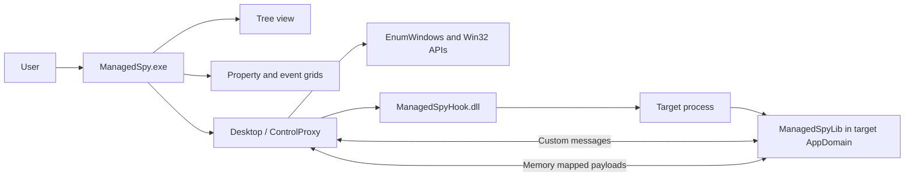

# ManagedSpy Architecture

ManagedSpy combines a Windows Forms inspector UI, a managed inspection library,
and a native C++/CLI hook shim. The native shim exists because Windows requires
the function passed to `SetWindowsHookEx` to come from a DLL export when the hook
is injected into another process.

## Component overview

| Component                            | Project or file                                                   | Responsibility                                                                 |
| :---                                 | :---                                                              | :---                                                                           |
| Inspector application                | [ManagedSpy](../../ManagedSpy/)                                   | Hosts the UI, tree, property grid, event grid, menus, and toolbar workflows.   |
| Managed inspection library           | [ManagedSpyLib](../../ManagedSpyLib/ManagedSpyLib.csproj)         | Provides `ControlProxy`, process filtering, IPC, and target-side message code. |
| Native hook shim                     | [ManagedSpyHook](../../ManagedSpyLib/ManagedSpyLib.vcxproj)       | Exports the hook callback used by `SetWindowsHookEx`.                          |
| Deterministic test target            | [ManagedSpy.TestTarget](../../ManagedSpy.TestTarget/)             | Provides a known compatible Windows Forms process for e2e validation.          |
| Automated tests                      | [ManagedSpy.Tests](../../ManagedSpy.Tests/)                       | Validates build outputs, screen bounds, startup, and UIAutomation inspection.  |
| Release build script                 | [build.ps1](../../build.ps1)                                      | Builds x86 and x64 release artifacts with full MSBuild and native toolchain.   |

## Runtime architecture

The inspector starts in `Program.Main`, initializes Windows Forms setup, creates
the message-filter window, and opens `MainForm`. `MainForm` immediately refreshes
the process/window tree by calling `ControlProxy.TopLevelWindows`, which delegates
to `Desktop.GetTopLevelWindows`.

## Window enumeration flow

1. The inspector calls `EnumWindows`.
2. Every top-level window handle is wrapped by `Desktop.GetProxy`.
3. `GetProxy` identifies the owning process with `GetWindowThreadProcessId`.
4. The process is checked for access, bitness compatibility, and compatible .NET
   runtime modules.
5. Compatible target windows receive a `ManagedSpyMessages.GetProxy` request.
6. If the target returns a managed `ControlProxy`, ManagedSpy displays managed
   component metadata. Otherwise it displays a native fallback proxy.

Native fallback proxies still have a window handle and Win32 class name, but they
do not expose managed properties, managed child paths, or event descriptors.

## Hook installation

`Desktop.EnableHook` loads `ManagedSpyHook.dll` from the inspector application
directory and obtains the exported `MessageHookProc` callback. It installs a
thread-specific `WH_CALLWNDPROC` hook for the target window thread.

The hook shim then:

- Locates its own DLL path.
- Loads [ManagedSpyLib.dll](../../ManagedSpyLib/ManagedSpyLib.csproj) from the
  same directory as the hook DLL.
- Registers an assembly resolver so target-side dependencies beside the hook
  can be loaded.
- Resolves `Microsoft.ManagedSpy.HookBridge.MessageHookProc`.
- Forwards hook notifications into `Desktop.OnMessage`.

The hook callback catches all exceptions before calling `CallNextHookEx`, because
unhandled exceptions in the injected hook path could destabilize the target
process.

## Cross-process message protocol

ManagedSpy uses custom Windows messages defined in `ManagedSpyMessages`. The
messages are sent to target windows with `SendMessageTimeout`, and larger
payloads are exchanged through memory-mapped files managed by `MemoryStore`.

| Message                                      | Direction              | Purpose                                                        |
| :---                                         | :---                   | :---                                                           |
| `IsManaged`                                  | Inspector to target    | Checks whether a window maps to a Windows Forms `Control`.     |
| `GetProxy`                                   | Inspector to target    | Creates or returns a serializable `ControlProxy`.              |
| `GetManagedProperty`                         | Inspector to target    | Reads a selected managed property value.                       |
| `SetManagedProperty`                         | Inspector to target    | Writes an editable managed property value.                     |
| `ResetManagedProperty`                       | Inspector to target    | Resets a property through its descriptor.                      |
| `GetManagedScreenRect`                       | Inspector to target    | Computes control bounds using target-side Windows Forms logic. |
| `SubscribeEvent` / `UnsubscribeEvent`        | Inspector to target    | Attaches or removes event handlers in the target process.      |
| `EventFired`                                 | Target to inspector    | Sends event log entries back to the inspector.                 |
| `WindowDestroyed` / `HandleChanged`          | Target to inspector    | Keeps the proxy cache aligned with handle lifecycle changes.   |
| `ReleaseMemory`                              | Either direction       | Releases memory-mapped payload stores after a transaction.     |

The memory-map names currently follow the pattern
`MSFT_ManagedSpy_PARAMS.<processId>.<transactionId>` and
`MSFT_ManagedSpy_RETVAL.<processId>.<transactionId>`. The transaction ID range is
bounded, and a send timeout prevents permanent hangs when a target process stops
responding.

## Control proxy model

`ControlProxy` is serializable and represents either:

- A managed Windows Forms control returned from inside the target process.
- A native window fallback created from a raw window handle.

For managed controls, the proxy captures:

- Window handle.
- Component name.
- Class name and assembly-qualified type name.
- Managed child path for nested controls.
- Assembly paths visible in the target AppDomain.
- Event and property descriptor accessors.

When the property grid later needs type information, the inspector resolves the
target type by loading recorded assemblies where possible. This is why property
inspection is richer for compatible Windows Forms controls than for native
fallback windows.

## Event logging architecture

When event logging is enabled, `MainForm` subscribes to selected events from the
currently selected `ControlProxy`. Target-side handlers are created dynamically
with `Delegate.CreateDelegate` and attached to target controls.

When an event fires:

1. The target-side handler serializes the event descriptor code and event args.
2. The target sends `ManagedSpyMessages.EventFired` to the inspector event
   window.
3. The inspector maps the event code back to the selected proxy event descriptor.
4. `MainForm.ProxyEventFired` appends a row to the event grid.

Serializable event args are sent directly. Mouse event args have a serializable
wrapper. Other non-serializable event args are represented by a fallback wrapper.

## Highlighting architecture

ManagedSpy has two highlighting modes:

- Temporary flash highlighting, used by **Show Window** and element finder.
- Persistent highlighting, enabled by the **Keep Highlighted** context-menu item.

Both modes use borderless transparent overlay forms positioned over the target
rectangle. Screen bounds prefer target-side Windows Forms information, then fall
back to native window rectangles when DPI or accessibility bounds do not match
the actual root window.

