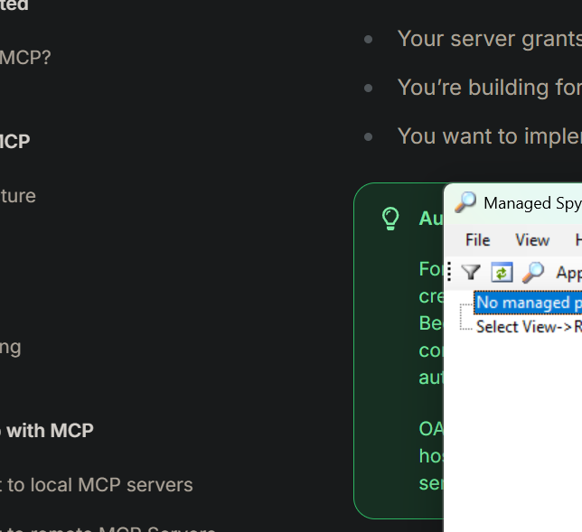
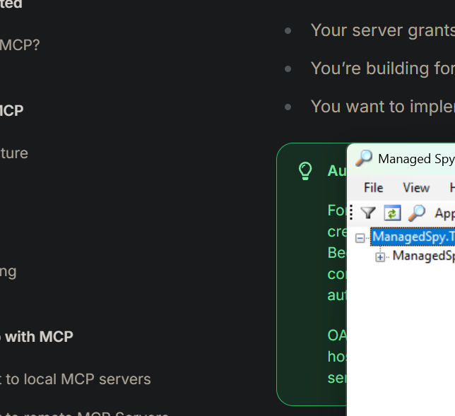
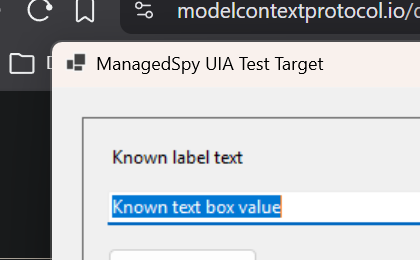

# ManagedSpy Specification

ManagedSpy is a Windows desktop inspection tool for runtime inspection of
Windows Forms applications. This specification documents the current .NET 10
port, including architecture, process compatibility, workflows, and operational
limitations.

## Documentation map

| Document                                                        | Purpose                                                                 |
| :---                                                            | :---                                                                    |
| [Architecture](architecture.md)                                 | Describes the UI process, hook shim, managed bridge, and IPC protocol.  |
| [Process compatibility](process-compatibility.md)               | Defines what kinds of processes can be inspected and why.               |
| [Features and workflows](features-and-workflows.md)             | Explains the runtime inspection features and how each workflow behaves. |
| [Usage manual](usage-manual.md)                                 | Provides step-by-step build, launch, inspection, and troubleshooting.   |

## Current scope

ManagedSpy is designed for these scenarios:

- Inspecting compatible .NET 10 Windows Forms applications on Windows.
- Viewing a process and window tree grouped by owning process.
- Reading component metadata and properties from inspected controls.
- Updating editable properties through the property grid.
- Logging selected events raised by a selected control.
- Locating a control by pointing at a screen element.
- Temporarily or persistently highlighting target windows and controls.

ManagedSpy is not a general UI Automation replacement. It uses a Win32 hook and
managed Windows Forms reflection to inspect target controls from inside the
target process, so its useful managed-inspection surface is intentionally tied to
Windows Forms and compatible .NET runtime conditions.

## Screenshots

The following screenshots were captured from a local x64 build of this port.

## Source-code entry points

The main implementation areas are:

- [ManagedSpy\Program.cs](../../ManagedSpy/Program.cs) starts the application.
- [ManagedSpy\MainForm.cs](../../ManagedSpy/MainForm.cs) implements the user
  interface and inspection workflows.
- [ManagedSpyLib\Desktop.cs](../../ManagedSpyLib/Desktop.cs) handles window
  enumeration, hook installation, process filtering, and message dispatch.
- [ManagedSpyLib\ControlProxy.cs](../../ManagedSpyLib/ControlProxy.cs) is the
  serializable representation of a target control.
- [ManagedSpyLib\MemoryStore.cs](../../ManagedSpyLib/MemoryStore.cs) implements
  the memory-mapped IPC payload channel.
- [ManagedSpyLib\HookShim.cpp](../../ManagedSpyLib/HookShim.cpp) exports the
  native hook callback and bridges into managed code inside the target process.
- [ManagedSpy.TestTarget](../../ManagedSpy.TestTarget/) is a deterministic
  Windows Forms target used by the e2e test workflow.

